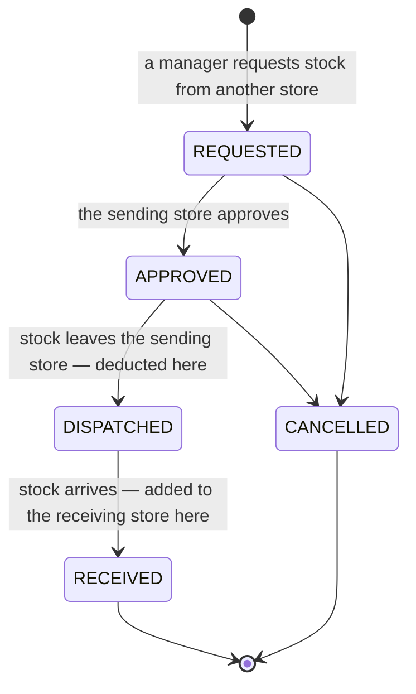
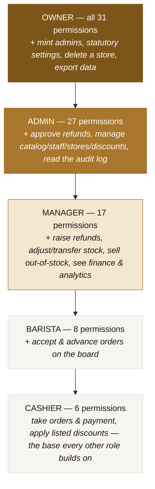
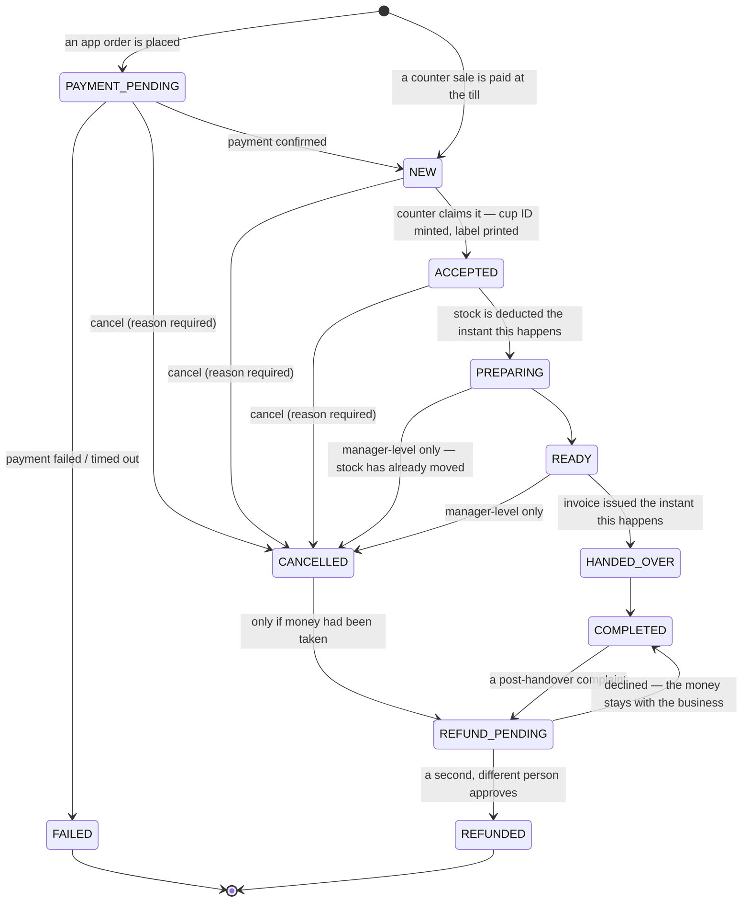
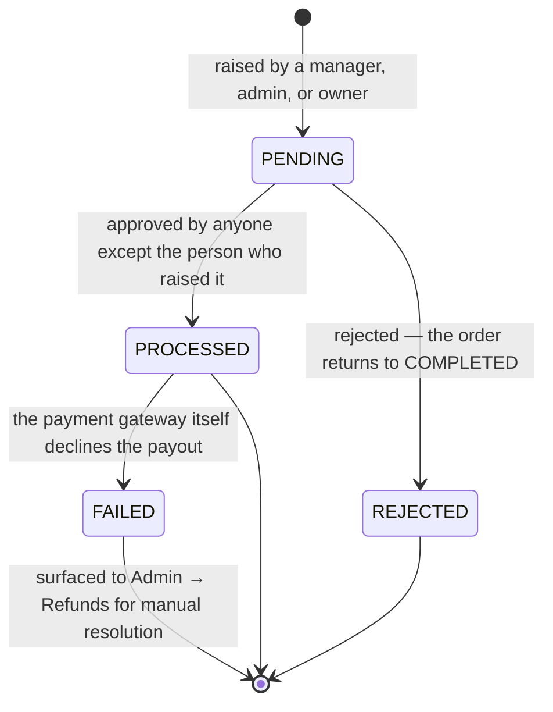

# NOOKAA POS — Product & Technical Overview

**Audience:** business stakeholders, operations staff/users, and the developer/engineering team.
**How to read this:** the first half (Sections 1–5) describes NOOKAA the *product* — what it does and why — in plain language. From Section 6 onward the detail gets progressively more technical, for anyone building or extending the system. **Appendix A tells the engineering team exactly what's real today versus planned** — the rest of the document describes the system as designed, on the assumption (confirmed by the developer) that the backend/database described throughout will be in place for testing and demo.

---

## 1. What NOOKAA is

**NOOKAA — Beverages & Beyond** is a grab-and-go specialty beverage brand (coffee, tea, cold brew, blended drinks). NOOKAA POS is the software that runs its stores end to end: the counter, the bar, the pickup shelf, and the back office — for a business built around one promise: **a drink in under three minutes**, whether the customer is standing at the till or has ordered ahead from an app.

It is not a generic point-of-sale package with beverage features bolted on. Every design decision — how stock is tracked, when an invoice is issued, how a cup gets to the right hand — starts from the physical reality of a small counter moving fast, and works backward from there.

### Who uses it

| Persona | What they do in the system |
|---|---|
| **Barista / Cashier** | Take orders at the counter, apply listed discounts, take payment, print the cup label, work the order board, hand drinks to customers |
| **Store Manager** | Everything a barista does, plus stock adjustments, transfers, refund approvals, availability changes, and their store's reporting |
| **Admin (head office)** | Manage the menu and pricing, staff and roles, discounts, all stores, and see finance and analytics across the business |
| **Owner** | Everything Admin can do, plus the handful of actions reserved for founders: minting other admins, changing statutory settings, deleting a store |
| **Customer** | Orders at the counter or (in the target design) ahead through an app; receives a WhatsApp confirmation, a ready alert, and a digital invoice; collects the drink by showing a QR code or pickup code |

---

## 2. The operational loop

This is the sequence that happens tens of thousands of times a day across every store, and everything else in the product exists to support it:

1. **Order** — a barista rings up a drink in one or two taps, or a customer orders ahead through the app.
2. **Pay** — cash, card, or UPI. The total is computed and verified by the system, never typed in by hand.
3. **Accept** — the counter claims the order; a cup ID is minted and a label prints with a QR code.
4. **Make** — the drink moves onto the three-column board (New → Making → Ready). The moment it's being made, the ingredients it uses are deducted from stock.
5. **Collect** — the customer is identified by scanning the cup label, or — for an app order — by the customer's own QR code or pickup code, so the right drink goes to the right person.
6. **Close out** — an invoice is issued and delivered by WhatsApp the moment the drink is handed over; the sale is now part of every report in the business.

Everything in Sections 3–7 is a variation on, or a support system for, this loop.

---

## 3. Core product decisions

Three choices run through the entire system and are worth understanding before anything else, because they explain *why* many features behave the way they do:

- **Money is always a whole number of paise.** Never a fraction, never a float, anywhere in the system — not in a discount, not in a tax calculation, not in a report. This is what makes every rupee in every report reconcile exactly.
- **Stock is deducted when a drink is *made*, not when it's *paid for*.** Payment can be reversed with a refund; milk that's been poured cannot. This one rule is why a cancelled order never silently leaves stock wrong.
- **Nothing financial is ever edited or deleted.** A cancellation, a refund, a price change — each is a *new* record layered on top of history, never an edit to an old one. An order's status timeline is a permanent, append-only log, which is what makes a dispute answerable weeks later and a shift's cash reconcile to the rupee.

A fourth, architectural decision shapes the technology (not the business logic): **the system is offline-first, not just offline-tolerant.** A store's till does not slow down or degrade when the internet drops — it does not notice. Every sale completes at full speed, prints its label, and queues to sync the moment a connection returns. Section 9 covers how.

---

## 4. Features, by area

### 4.1 The counter (POS)

- A product grid of the full menu — 50 drinks across 10 categories — with keyboard shortcuts for a mouse-free counter and search for a busy day.
- Tapping a drink with options (size, milk, sweetness, add-ons) opens a quick picker with sensible defaults pre-selected, so most drinks are still a single tap.
- A running ticket on the right with quantity controls, line-item pricing, and a live total.
- **Dine-in or takeaway**, chosen at checkout.
- **Discounts**: a barista can apply a listed, pre-approved discount code; a manager can go beyond the listed rules when a situation calls for it (`discount.override`), and that override is logged.
- **Charge**: cash (with change calculated automatically), card, or UPI. A card/UPI payment needs the network — cash does not, and works exactly the same speed offline.
- The moment an order is accepted, a **cup label** prints: a QR code, the order number in large type, the customer's name, and the drink with its modifiers — sized to wrap a cup and readable at a glance.

### 4.2 The order board (the kitchen, without a kitchen)

NOOKAA has one bar, no kitchen, so the board *is* the kitchen display:

- Three columns — **New → Making → Ready** — with every open ticket visible to everyone behind the counter.
- Every card carries a **brew clock**: elapsed time since the order was accepted, turning amber at two-thirds of the store's target time and red once it's overdue — and a late ticket automatically sorts to the top of its column, so working top-to-bottom is always working the right order.
- A drop-in **app order** arrives on the board exactly like a counter sale, with nothing in the interface to tell a barista the two apart — the same board, the same clock, the same next step.

### 4.3 Collecting the right drink

- **Scanning** works three ways that all resolve to the same action: a phone/tablet camera reading the QR, a hardware barcode scanner (which behaves like a keyboard — no special integration needed), or typing the code by hand. All three work identically, so a camera failing never stops the counter.
- **App orders carry their own customer-facing pickup code**, separate from the cup label, so the counter can't hand an app order over to someone who simply walked up and asked for "the ready one" — the customer has to actually produce their code or QR.
- A dedicated **Ready / Pickup** screen is sized for the counter, showing everything waiting to be collected.

### 4.4 Stock, at the counter and in the back office

- Baristas can see live stock levels for what's behind the bar and log **waste** (spillage, expiry) on the spot, with a reason required.
- The back office runs a full **inventory ledger**: every purchase, sale, waste event, adjustment, and stock count is an entry in an append-only log — never a single number that gets overwritten — which is what lets stock be recomputed from scratch at any time and always match.
- **Recipes** tie every drink to the ingredients and quantities it consumes (with a wastage allowance per line), so making a drink automatically draws the right amount of milk, coffee, and syrup from stock — no manual bookkeeping.
- **Transfers** move stock between stores through a Request → Approve → Dispatch → Receive flow; only the last two steps actually touch either store's stock, because stock in transit belongs to neither store yet. A transfer can still be called off before it's dispatched — once it's left the sending store, it can't be.
- A stock item's status — OK, Low, Critical, Out — is derived automatically from thresholds set per ingredient, and flows straight into what a barista sees on the POS grid (an out-of-stock drink greys out, unless a manager chooses to override it, which is itself logged).



### 4.5 Staff attendance

Signing in and out at a till *is* the attendance system — there's no separate step. Every clock-in and clock-out is timestamped against the shift, and the office sees a per-person attendance heatmap and summary, with the ability to record an approved leave day.

### 4.6 Loyalty — "Nooks"

Every completed order earns the customer **Nooks**, NOOKAA's own loyalty currency, calculated on what they actually paid (after any discount, never on the sticker price). Balances are tracked per customer, redeemable through the app, with its own admin section for reviewing balances and the full transaction ledger — nothing about a customer's coin balance is a black box.

### 4.7 The back office (Admin)

| Section | What it's for |
|---|---|
| **Today / Dashboard** | Sales, the live order count, money in, what's selling, and stock needing a decision — for the currently selected store |
| **Live orders** | A read-only mirror of the counter's board, for keeping an eye on service from the office |
| **Orders** | Every order the business has ever taken, searchable and filterable, with the complete status timeline for each one |
| **Catalog** — Products, Categories, Modifiers, Recipes | The full menu: pricing, cost, tax rate, availability (chain-wide or per store), and the recipe behind every drink, sorted so the thinnest-margin items are never out of sight |
| **Inventory** | The ledger, receiving stock, logging waste, stock counts, and inter-store transfers |
| **Finance** — Payments, Invoices, Refunds | Every payment taken (cash included), every GST invoice issued, and every refund — raised by one person, approved only by a *different* person |
| **Stores** | Store details, hours, service-area SLA, and location |
| **Devices** | Registering and retiring the tills, bar stations, and tablets each store runs on |
| **Staff** | The roster, roles, and a **live permission matrix generated directly from the code** — so the documented rules and the enforced rules can never quietly drift apart |
| **Attendance** | Clock-in/out history and the attendance heatmap |
| **Nooks** | Customer loyalty balances and the full earn/redeem ledger |
| **Discounts** | Creating and managing discount codes, including date windows, usage caps, and minimum-order rules |
| **Analytics** | Hourly demand shape, best- and worst-sellers, category and store performance splits |
| **Audit log** | A permanent, human-readable record of who did what — price changes, stock movements, refund approvals, availability changes — each entry written in plain English, not just raw data |
| **Settings** | Operational configuration: tax rates, printer setup, notification behaviour, and what's real versus mocked in the current build (see Appendix A) |

### 4.8 What the customer sees

- A **WhatsApp confirmation** the moment an app order is accepted, with an ETA.
- A **"ready for pickup"** WhatsApp and push alert the moment their drink is made, including their cup ID.
- A **digital GST invoice** delivered by WhatsApp within moments of collecting the drink, with SMS as a fallback if WhatsApp can't be reached.
- If an order is cancelled or refunded, a clear WhatsApp/SMS message stating why and, for a refund, that it will land back on their original payment method within 5–7 working days.

---

## 5. Roles and permissions

Five roles, each scoped to specific stores except the two head-office roles, who operate across the whole business:

| Capability | Barista | Cashier | Manager | Admin | Owner |
|---|:--:|:--:|:--:|:--:|:--:|
| Take orders on the POS | ● | ● | ● | ● | ● |
| Accept / advance an order | ● | — | ● | ● | ● |
| Cancel an order before it's made | ● | ● | ● | ● | ● |
| Cancel an order already on the bar | — | — | ● | ● | ● |
| Apply a listed discount | ● | ● | ● | ● | ● |
| Discount beyond the listed rules | — | — | ● | ● | ● |
| Raise a refund | — | — | ● | ● | ● |
| **Approve a refund** | — | — | — | ● | ● |
| See stock levels | ● | ● | ● | ● | ● |
| Adjust stock / transfer between stores | — | — | ● | ● | ● |
| Sell a drink that's out of stock | — | — | ● | ● | ● |
| Change the menu, prices and recipes | — | — | — | ● | ● |
| See the staff roster | — | — | ● | ● | ● |
| Add staff and change roles | — | — | — | ● | ● |
| **Create or edit an owner/admin account** | — | — | — | — | ● |
| See payments, invoices, refunds | — | — | ● | ● | ● |
| See sales reporting | — | — | ● | ● | ● |
| Read the audit log | — | — | — | ● | ● |
| Change statutory settings (GSTIN, currency) | — | — | — | — | ● |
| Archive a store | — | — | — | — | ● |

**Two rules worth calling out specifically**, because they're deliberate business controls, not incidental restrictions:

- **A barista can cancel an unpaid order but never approve a refund.** Cancelling before a drink is made is routine. Returning money is not, and the person holding the till should never be able to do that alone.
- **Whoever raises a refund can never be the one who approves it** — enforced by comparing user identities, not roles, so even two people with the same role can't clear each other's requests. This is the single cheapest control against a till being drained one "customer complaint" at a time.

A manager is pinned to the store(s) they're posted to; an admin or owner moves freely across every store in the business. And critically: **the buttons a role sees in the interface are a convenience, not the security boundary.** The system is designed so that every one of these rules is re-checked on the server, on every request, regardless of what the screen shows — see Section 8.

### Permission levels, visually

Each role strictly *contains* the one below it and adds a further slice of trust — nobody has a permission that the role beneath them lacks, which is what makes "can Y do what X can" always answerable by looking at one picture rather than auditing every screen:



This is a genuinely strict chain, not just a table read top to bottom: **every permission Cashier holds, Barista also holds** — a cashier is not a different specialisation from a barista, but literally a barista's access minus the two board actions (`order.accept`, `order.advance`), because a cashier takes payment but never touches order preparation. The same containment holds all the way up: there is no permission an Owner lacks that an Admin has, and so on down the chain — which is exactly what makes `canManageRole()` (Section 5) a safe, one-line check: a role can only ever manage the roles strictly below it in this same picture.

---

## 6. The order lifecycle

Every order moves through a fixed set of states, and only the moves shown below are legal — anything else is rejected outright, which is what makes an "impossible" order state actually impossible rather than just unlikely:



Two branches are easy to miss reading a table but matter operationally: a refund can be requested from **either** a cancelled order (money taken, then the order called off) **or** a completed one (a complaint after the drink was already handed over) — both land in the same `REFUND_PENDING` state and go through the same second-person approval either way.

A cancellation always requires a stated reason; every state change is written to a permanent, append-only timeline attached to the order, visible on the order's own detail screen. **A completed order can never be turned back into a cancelled one** — the only way to unwind a finished sale is a refund, by design, so that history is never quietly rewritten.

---

## 7. Money, tax and compliance

- **Pricing** is computed once, server-side, from the catalog — never trusted from what a device claims. A discount reduces the subtotal; **GST is then calculated on the discounted amount**, not the sticker price, which is the correct tax treatment and the more common mistake to get backwards.
- **GST invoices** carry a gapless, sequential number per store per financial year (`NK/MUM01/25-26/000123`) — a statutory requirement that cannot be met by tills issuing numbers independently, so numbering is centralised and allocated only inside the same transaction that creates the invoice. A failed transaction never burns a number.
- An invoice is issued the moment a drink is **handed over**, because GST is owed when the goods are supplied — a paid order cancelled before pickup never needed an invoice in the first place, so no correction is needed either.
- **Refunds** are always a new record, never an edit to the original sale, and always require a second, different person's approval before money moves.
- **Cash reconciles against the same ledger as every other payment method** — there's one source of truth for what a shift took in, not a separate cash count that has to be reconciled by hand.

### The refund record itself

The order's own state (Section 6) only shows *whether* a refund is pending or settled. The refund record underneath it carries the second-person approval rule and the payment gateway's own outcome:



---

## 8. Security posture

- **Client-side role checks are ergonomics, not enforcement.** Hiding a button from a barista is a convenience for a device anyone can pick up and inspect. The rule that actually matters is re-derived from the session and re-checked on every request, server-side, regardless of what the screen shows.
- **PINs are the sign-in method**, chosen deliberately over passwords because staff sign in repeatedly through a shift with wet hands on a touchscreen. What makes a short PIN acceptable is everything around it: strong hashing (never a plain comparison), an account lockout after repeated failures, sign-in restricted to a store the person is actually posted to, and every action attributed to a specific person on a specific device.
- **Nothing about a payment secret ever reaches a till.** Payment provider keys, signature verification, and refund issuance all happen on the server; a device holds only what it needs to display a checkout, never a credential that could authorise money to move on its own.
- **A cup's QR token is a handle, not a password** — it identifies an order for lookup, but collecting a drink requires a signed, expiring token the server issued, not something a customer or a bystander could guess or forge from the visible cup ID.
- **The device itself is never trusted.** Anyone holding a till can open its browser tools and inspect what's stored locally — so nothing security-relevant is ever decided by what's sitting on the device. Every meaningful decision (a price, a permission, a refund approval) is re-derived centrally.

*(Appendix A notes exactly where the current build stands against this model — the design above holds regardless of what's wired up yet.)*

---

## 9. How it's built (technical architecture)

### 9.1 Why offline-first

A store's till cannot wait for the network, because a Mumbai retail connection drops without warning and a sale still has to complete in seconds. The architecture follows one rule end to end: **a screen writes to the device, then the device tells the server** — never the other way around.

```
Screens (POS · Board · Scan · Ready · Admin)
   │
Services (order · payment · inventory · invoice · qr · print · notification · sync)   ← business rules enforced here
   │
Repositories (persistence behind a single interface)
   │
Local storage on the device (IndexedDB)
   │
   └── an outbox queue ──► sync engine ──► the server API
```

A screen never writes state directly — it calls a service, the service enforces the rule and writes through a repository, and that single choke point is why the order state machine (Section 6) cannot be bypassed by a stray button anywhere in the interface.

### 9.2 The offline queue (the outbox)

Every order gets its identifier the moment it's created, **on the device**, not from the server. That single choice is what makes the rest of offline-first work: a retried sync can never create a duplicate, because the record already has a permanent identity before the server has ever heard of it. Every write queues in an on-device outbox with an idempotency key, syncs in the background with exponential backoff the moment a connection exists, and is never dropped — a failed sync is visible to staff and to the office, never silent.

### 9.3 Integrations

| Integration | What it does | Key design point |
|---|---|---|
| **Payments — Razorpay** | Card and UPI capture, signature verification, refund issuance | The provider's secret key never reaches a browser; a client only ever holds a public key ID. Cash is recorded as a first-class payment method in the same ledger. |
| **Notifications — WhatsApp (SMS fallback)** | Order confirmation, ready alert, invoice delivery, cancellation/refund notices | WhatsApp first because that's what a customer actually opens; every message type has a defined fallback and a visible delivery status rather than a silent failure. |
| **Printing** | Cup labels (50×40mm thermal) on accept, receipts on request | A failed print never blocks an order — the cup ID exists regardless, and a label can always be reprinted, or in the worst case written by hand. |
| **Realtime updates** | New orders and status changes appearing live on every device at a store | Built on a single, one-way, auto-reconnecting stream (no bidirectional complexity needed) that degrades gracefully to polling, then to the device's own local state — nothing that affects whether a sale can complete ever depends on this being live. |
| **Maps / store location** | Resolving a store's address to a map link for customer-facing use | — |

### 9.4 Data model, at a glance

The system's records fall into five groups:

- **Tenancy & identity** — organisation, stores, users, devices, and which stores each user may act in.
- **Catalog** — categories, products, modifier groups and options, tax rates, discounts.
- **Orders** — the order, its line items, and its append-only status timeline.
- **Money** — payments, refunds, invoices.
- **Inventory** — ingredients, recipes, stock levels, the inventory ledger, transfers.
- **Operational logs** — customers, cup tokens and scan history, notifications sent, the audit log, staff shifts.

Every store-scoped table carries a store identifier, and every query is filtered by it in one shared place rather than being re-implemented per screen — which is what prevents one store's data ever leaking into another's view by accident.

### 9.5 The API surface, by area

`Auth` (login/session) · `Catalog` (menu CRUD) · `Orders` (create, list, detail, transition) · `Payments` (Razorpay order/verify, cash, webhooks) · `Refunds` (raise, approve, reject) · `Invoices` (issue, send, PDF) · `Cups` (issue, resolve a scan, void) · `Inventory` (levels, transactions, transfers) · `Customers` · `Reporting` (sales, products, operations) · `Sync` (the offline batch endpoint) · `Realtime` (the live stream).

### 9.6 Multi-store from day one

The organisation → store → device/user/order hierarchy exists from the very first version, even for a single-organisation business today, because retrofitting multi-tenancy later is one of the most expensive changes a system can be asked to make. Adding a new store is entirely configuration — creating it, registering its devices, assigning staff, setting stock levels — nothing in the underlying system needs to change.

### 9.7 Performance targets

| Interaction | Target |
|---|---|
| Tap a product → it's in the ticket | under 50 ms |
| Charge → cup label appears | under 400 ms |
| Board refresh after a status change | under 100 ms |
| Cold start on a mid-range tablet | under 2.5 s |

---

## 10. Operating the business — monitoring & continuity

- **The system is designed so a total backend outage never stops a store from trading.** Devices keep working from local storage, keep printing labels, and queue everything to sync once service is restored. What's unavailable during an outage is limited and known: card/UPI payments (the payment gateway itself is unreachable), new sign-ins (existing sessions keep working), new app orders, and the admin back office. The rule of thumb for a store in that situation is one sentence: *take cash, keep serving, everything syncs when we're back.*
- **What actually pages someone at 3am**: the two categories that matter are money (a payment capture failure spike, a reconciliation mismatch) and statutory risk (a gap in invoice numbering). Everything else — a slow API, a device that's been offline a while — is a business-hours problem.
- **Backups are tested by restoring them**, on a schedule, into a scratch environment and comparing totals against production — not by checking that a backup job reported success.

---

## 11. Roadmap

### Phase 0 — where the product is now
A complete, fully-functional frontend covering every feature in Section 4, running entirely on the device with no backend yet connected (see **Appendix A**).

### Phase 1 — near term (foundational, unlocks everything after)
- The real backend and database behind the current interface — the single item everything else in this list depends on.
- A local print agent for silent, dialog-free label printing at the counter.
- Server-issued, cryptographically signed cup tokens (closing the last gap in the pickup design).
- Shift close and cash counting, so a till variance is attributable to a person and a shift.
- Credit notes and partial refunds (a partial refund is a statutory requirement that needs its own numbered document — this ships together with real backend support).
- Self-hosted fonts, ahead of a formal go-live.

### Phase 2 — medium term
- **A customer-facing ordering app** — the current architecture already treats an app order as a first-class citizen on the board for exactly this reason; the app becomes a new client of the same system, not a rebuild of it.
- **Demand forecasting** — enough order history exists after a few months of live trading to predict tomorrow's stock needs better than a manager's memory.
- **Enhanced loyalty mechanics** — Nooks already tracks balances and a full ledger today; once there's a measured repeat-purchase rate, the reward mechanic itself can be tuned deliberately rather than copied from elsewhere.
- **Staff scheduling against forecasted demand.**
- **Multi-organisation / franchise support** — the data model already carries an organisation boundary on every core record; this phase adds organisation-scoped administration on top of it.

### Phase 3 — longer term
- **Kiosk / self-order mode**, reusing the existing counter interface on a locked-down customer-facing tablet.
- **Dynamic, scheduled pricing** (e.g. off-peak rates) — the discount engine already exists; this adds scheduling on top of it.
- **Cross-store inventory optimisation** — system-suggested transfers ahead of a stockout, once demand forecasting exists.
- **Vendor-managed replenishment** — automatic purchase orders from reorder thresholds and supplier lead times.

### Deliberately out of scope, on principle
A few things are worth naming as *decisions*, not gaps, because they will keep being suggested:

- **A generic "custom item" button on the till** — it would quietly defeat the recipe system, the inventory ledger, and margin reporting in a single tap.
- **Editable order history** — a mistake gets corrected with a new, compensating record, never an edit. The moment history can be edited, it stops being trustworthy as evidence.
- **Client-side price overrides** — discounts are catalog entities with defined rules and approval; letting anyone type an arbitrary number into a till is exactly how margin quietly disappears.

---

## Appendix A — Current implementation status (for the engineering team)

The product above describes NOOKAA **as designed**. As of this document, the build is a **complete, fully-functional frontend running entirely in the browser** (IndexedDB), with the backend described throughout this document not yet connected — confirmed with the developer as the near-term Phase 1 priority, not an open question.

| Area | Status today |
|---|---|
| Ordering, the board, cup labels, scanning, pickup verification, stock, catalog, discounts, refunds, staff, attendance, Nooks, analytics, audit log | **Fully functional**, running against on-device storage |
| Money arithmetic, the order state machine, the inventory ledger, GST calculation | **Real and correct** — this is genuine business logic, not a placeholder |
| A real backend, database, and multi-device data sharing | **Not yet connected.** Every device is currently its own island; two tills at the same store do not see each other's sales yet. This is Phase 1's first item. |
| Payments (Razorpay), WhatsApp/SMS notifications, printing, real-time sync | **Simulated** behind the same interfaces the real integrations will use — swapping in the genuine provider is a scoped, contained change per integration, not a redesign |
| PIN security / session enforcement | Currently enforced only in the browser, since there is no server yet to be the actual authority — this is expected to be substantially strengthened once the backend lands, and should be re-verified at that point |
| Server-signed cup tokens | Currently device-generated rather than server-signed; listed explicitly in Phase 1 |
| Partial refunds / credit notes | Not yet exposed in the interface (full refunds only); the data model already anticipates them, per Phase 1 |

**For a detailed, code-level gap analysis of the current build** (edge cases, validation gaps, and items worth testing before each phase ships), see [`../qa/QA-FINDINGS.md`](../qa/QA-FINDINGS.md). That document is maintained separately and updated as the implementation changes; this document describes the product, that one tracks its current defects.

## Appendix B — Glossary

| Term | Meaning |
|---|---|
| **Nooks** | NOOKAA's loyalty currency, earned on every order and redeemable through the customer app |
| **Cup ID / cup label** | The short code and QR-bearing label printed the moment an order is accepted, used to identify and collect the right drink |
| **Pickup code** | A separate, customer-facing code (distinct from the cup ID) that an app-ordering customer must produce to collect their drink |
| **Brew clock / SLA** | The elapsed-time indicator on every order card, tied to each store's target preparation time |
| **Paise** | 1/100th of a rupee — the unit all money is stored and calculated in, to avoid any rounding error |
| **Business day** | A store's trading day, which rolls over at its own opening time rather than at midnight, so a late-night sale is grouped with the day it actually belongs to |
| **Outbox / sync engine** | The on-device queue and background process that gets an order from the till to the server once a connection exists |
| **Second-person approval** | The rule that whoever raises a refund can never be the one who approves it |
